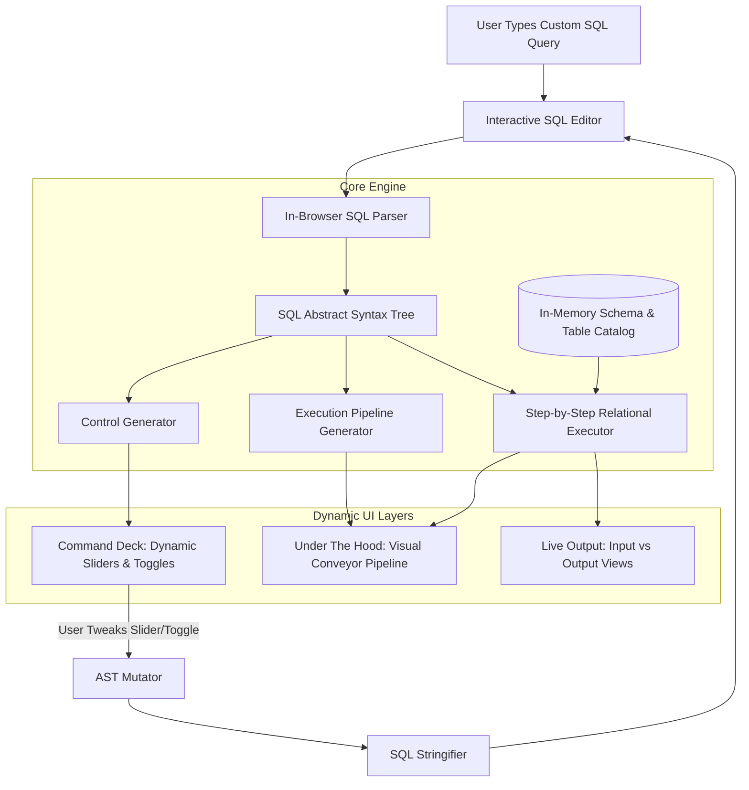
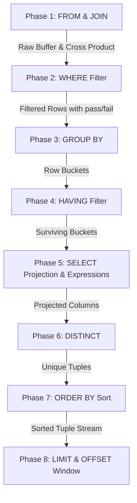

# Phase 2 Architecture & Implementation Plan: Dynamic SQL Query Engine
**Project**: SQL Visualizer (Query Machine)  
**Author**: Antigravity Pair Programmer  
**Target Milestone**: Phase 2 — Custom User Queries, Auto-Generated Controls & Dynamic Visual Execution Pipeline  

---

## 1. Executive Summary & Vision

Currently in **Phase 1**, SQL Visualizer operates in **Curriculum Mode** — a handcrafted, highly polished educational tour with 7 fixed levels (Filtering, Aggregates, Group By, Having, Joins, Set Operations, Subqueries) operating on static tables (`posts`, `users`).

In **Phase 2**, we introduce **Sandbox Mode (Dynamic Query Machine)**:
* Users can type or paste **any valid SQL query** into an interactive code editor.
* An in-browser SQL Parser parses the query into an **Abstract Syntax Tree (AST)**.
* The system **dynamically generates UI controls** (sliders, column chips, sort buttons, join selectors) tailored directly to the parsed query.
* A **Dynamic Relational Engine** executes the query step-by-step through standard SQL execution order (`FROM` → `WHERE` → `GROUP BY` → `HAVING` → `SELECT` → `ORDER BY` → `LIMIT`), generating intermediate row snapshots.
* The **Under the Hood** panel dynamically renders animated visual pipeline stages for any arbitrary query.
* Two-way bidirectional sync ensures that editing code updates controls, and tweaking controls updates the code editor in real time.

---

## 2. System Architecture Overview



---

## 3. Technology Stack & Key Dependencies

| Component | Recommended Tool | Purpose & Justification |
| :--- | :--- | :--- |
| **SQL Parser & Formatter** | `node-sql-parser` | Lightweight (runs 100% in-browser), parses MySQL/PostgreSQL/SQLite into JSON AST and formats AST back into clean SQL (`sqlify`). Supports `WHERE`, `JOIN`, `GROUP BY`, `HAVING`, `SUBQUERY`, `UNION`. |
| **SQL Code Editor** | `@monaco-editor/react` or `@codemirror/lang-sql` | CodeMirror 6 is recommended for low bundle footprint (~120KB) and excellent mobile support, offering syntax highlighting, autocompletion, and error squigglies. |
| **In-Memory Database** | Custom TS Relational Tracing Engine + Optional `sql.js` (SQLite WASM) | Custom TS engine allows capturing granular row-by-row pass/fail metadata at every clause stage, which standard SQL engines discard. |
| **State Management** | `zustand` (existing) | Clean reactive slice `useDynamicQueryStore` handling AST, intermediate frames, active step, and user datasets. |
| **Animations** | `framer-motion` (existing) | Shared layout animations for row chips traveling through dynamic pipeline stages. |

---

## 4. Detailed Component Design

### 4.1 SQL Parsing & AST Normalization

When the user enters a query:
```sql
SELECT username, likes_count 
FROM posts 
WHERE likes_count > 300 AND format = 'video' 
ORDER BY likes_count DESC 
LIMIT 5;
```

`node-sql-parser` produces an AST structure:
```json
{
  "type": "select",
  "columns": [
    { "expr": { "type": "column_ref", "column": "username" } },
    { "expr": { "type": "column_ref", "column": "likes_count" } }
  ],
  "from": [{ "db": null, "table": "posts", "as": null }],
  "where": {
    "type": "binary_expr",
    "operator": "AND",
    "left": {
      "type": "binary_expr",
      "operator": ">",
      "left": { "type": "column_ref", "column": "likes_count" },
      "right": { "type": "number", "value": 300 }
    },
    "right": {
      "type": "binary_expr",
      "operator": "=",
      "left": { "type": "column_ref", "column": "format" },
      "right": { "type": "single_quote_string", "value": "video" }
    }
  },
  "orderby": [
    { "expr": { "type": "column_ref", "column": "likes_count" }, "type": "DESC" }
  ],
  "limit": { "value": [{ "type": "number", "value": 5 }] }
}
```

---

### 4.2 Dynamic Control Generator (Command Deck)

The system inspects the AST nodes and automatically maps clauses to interactive UI widgets:

| AST Clause | Detected Pattern | Generated UI Widget |
| :--- | :--- | :--- |
| **`WHERE` numeric binary** | `col > val`, `col < val`, `col >= val` | **Slider with Bubble**: dynamically sets min/max from table stats. Moving slider updates `val`. |
| **`WHERE` categorical** | `col = 'val'`, `col IN ('a', 'b')` | **Option Chips / Pills**: populated with unique values from the target column. Clicking toggles selection. |
| **`SELECT` column_ref** | `SELECT col1, col2...` | **Multi-Select Column Chips**: all table columns listed. Tapping adds/removes column from projection list. |
| **`GROUP BY`** | `GROUP BY col` | **Dropdown / Segmented Buttons**: lists available grouping columns. |
| **`HAVING`** | `HAVING agg_fn(col) > val` | **Operator Selector & Threshold Slider**. |
| **`ORDER BY`** | `ORDER BY col [ASC\|DESC]` | **Column Dropdown + ASC/DESC Toggle Button**. |
| **`LIMIT`** | `LIMIT n` | **Stepper `[-] N [+]` + Slider**. |
| **`JOIN`** | `[type] JOIN table ON cond` | **Join Type Tabs**: `INNER`, `LEFT`, `RIGHT`, `FULL OUTER`, `CROSS`. |

---

### 4.3 Bidirectional Two-Way Binding (Editor ⇄ Controls)

To keep the SQL editor and the generated controls perfectly in sync:

```
[User Edits Code in Editor] 
        │ (Debounced 150ms)
        ▼
   Parse to AST
        │ (Success)
        ▼
Update Controls State ───> UI Sliders move to match code values!
```

```
[User Drags Slider in Controls]
        │ (Instant)
        ▼
Mutate Specific AST Node (e.g., ast.where.left.right.value = 450)
        │
        ▼
`parser.sqlify(ast)`
        │
        ▼
Update Code Editor Text ───> Code updates live without resetting cursor!
```

* **Handling Syntax Errors**: If the user types invalid SQL (e.g. `SELECT FROM WHERE`), the parser catches the error. The UI displays an inline warning banner (`⚠️ Syntax error on line 1: unexpected token 'FROM'`), retaining the last valid pipeline state so the visualizer never crashes.

---

### 4.4 The Step-by-Step Relational Execution Pipeline

Traditional SQL databases compile queries into binary execution plans and only return the final result. For a visualizer, we need **intermediate row states** at every step.

The engine executes the relational algebra steps in strict SQL logical processing order:



At each stage $i$, the engine records:
```ts
interface ExecutionStageFrame {
  stageName: "FROM" | "WHERE" | "GROUP BY" | "HAVING" | "SELECT" | "ORDER BY" | "LIMIT";
  stageIndex: number;
  stageSummary: string; // e.g. "WHERE likes_count > 300 dropped 12 rows"
  inputRows: Row[];
  outputRows: Row[];
  droppedRows: Row[];
  rowMetadata: Map<string | number, {
    passed: boolean;
    reason?: string;
    evaluatedExpression?: string;
    groupKey?: string;
  }>;
}
```

---

### 4.5 Dynamic "Under the Hood" Visual Renderer

The Middle Panel dynamically renders a conveyor pipeline matching the active query's clauses:

1. **Stage 1: FROM / JOIN**:
   - If single table: displays the raw table buffer loaded from disk.
   - If JOIN: displays the bipartite relational graph matching left keys to right keys with animated bezier connectors, plus a dynamic 2-circle Venn diagram.
2. **Stage 2: WHERE Clause**:
   - Renders a conveyor belt or sieve.
   - Each row card displays its values with green `✓ PASS` or red `✗ FAIL` badge indicating the condition check.
3. **Stage 3: GROUP BY**:
   - Renders animated bucket cards labeled with each unique group key.
   - Rows smoothly slide and drop into their corresponding bucket.
4. **Stage 4: HAVING**:
   - Evaluates aggregate conditions on each bucket, stamping `SURVIVED` or `REJECTED (Whole Bucket)`.
5. **Stage 5: SELECT Projection**:
   - Unselected columns fade out with strikethrough lines; kept columns animate into the final projected shape.
6. **Stage 6: ORDER BY & LIMIT**:
   - Rows re-order into sorted ranks (`#1`, `#2`, `#3`), and rows beyond the LIMIT threshold are cut with a dashed boundary.

---

### 4.6 Custom Table & Dataset Management

Users can experiment with different datasets in three ways:

1. **Preset Catalog (Instant One-Click Switch)**:
   * **Social Network**: `posts` (20 rows), `users` (6 rows)
   * **E-Commerce**: `orders`, `products`, `customers`
   * **University**: `students`, `courses`, `enrollments`
2. **CSV / JSON Upload**:
   * User drops a CSV file. The engine infers column names, data types (`int`, `varchar`, `date`), and populates in-memory buffer.
3. **Raw DDL Input**:
   * User can run standard DDL statements:
     ```sql
     CREATE TABLE inventory (id INT, item VARCHAR(50), price INT);
     INSERT INTO inventory VALUES (1, 'Keyboard', 45), (2, 'Mouse', 25);
     ```

---

## 5. Implementation Roadmap (Phase 2 Milestones)

### Milestone 1: SQL Parser Integration & AST Store (Week 1)
* Install and benchmark `node-sql-parser`.
* Implement `useDynamicQueryStore` handling code state, AST state, parse errors, and active dataset.
* Implement bidirectional AST stringifier (`astToSql`).

### Milestone 2: Code Editor Component & Dynamic Controls (Week 2)
* Embed CodeMirror SQL editor in Command Deck with syntax highlighting and auto-formatting.
* Build `ControlGenerator` that walks the AST and renders dynamic Sliders, Column Chips, and Sort buttons.
* Implement bidirectional synchronization between editor typing and control slider dragging.

### Milestone 3: Dynamic Step-by-Step Relational Engine (Week 3)
* Implement modular execution nodes in TypeScript:
  * `executeFrom(fromAst, catalog)`
  * `executeWhere(rows, whereAst)`
  * `executeGroupBy(rows, groupByAst, selectAst)`
  * `executeHaving(groups, havingAst)`
  * `executeSelect(rows, selectAst)`
  * `executeOrderBy(rows, orderByAst)`
  * `executeLimit(rows, limitAst)`
* Produce `ExecutionStageFrame[]` snapshots on every query change.

### Milestone 4: Generic "Under the Hood" Visual Components (Week 4)
* Refactor visual components (`RowChip`, `ConveyorBelt`, `BucketContainer`, `BipartiteGraph`, `VennDiagram`) to accept generic `Row` objects instead of static `PostRow`.
* Build pipeline stage auto-sequencer that renders only the phases present in the user's query.

### Milestone 5: Custom Datasets & Polish (Week 5)
* Implement Dataset Switcher (Social, E-Commerce, School).
* Add CSV Import modal with automatic schema inference.
* Polish animations, error handling, and performance caching.

---

## 6. Edge Cases & Safety Constraints

1. **Unsupported SQL Features**:
   * If a user writes an extremely complex unsupported feature (e.g. recursive CTEs, window functions like `ROW_NUMBER() OVER (...)`, or stored procedures):
   * *Graceful Fallback*: Display a friendly banner: *"Window functions are coming in a future update! Try basic SELECT, JOIN, GROUP BY, or Subqueries."*
2. **Performance with Large Datasets**:
   * For visual row-by-row animation to remain 60fps smooth, client-side dataset size should be capped at **500 rows** in Sandbox Mode. Queries on larger tables will show a message: *"For visual clarity, rendering the first 100 rows in pipeline animation."*
3. **Infinite Loops or Malicious Input**:
   * Since execution runs 100% in-browser on in-memory JavaScript objects, there is zero backend security risk (no SQL injection possible against a server database).

---

## 7. Conclusion

By transitioning from fixed static levels to this **Dynamic Relational Engine**, SQL Visualizer transforms from an educational tutorial into the **ultimate interactive SQL playground and debugging tool** for developers, educators, and students worldwide.
